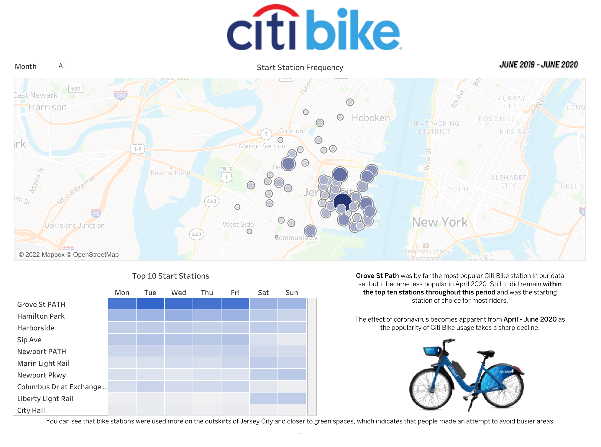

# Citi-Bike-Analytics

## Background

Congratulations on your new job! As the new lead analyst for the [New York Citi Bike](https://en.wikipedia.org/wiki/Citi_Bike) Program, you are now responsible for overseeing the largest bike-sharing program in the United States. In your new role, you will be expected to generate regular reports for city officials looking to publicize and improve the city program.

Since 2013, the Citi Bike Program has implemented a robust infrastructure for collecting data on the program's utilization. Each month, bike data is collected, organized, and made public on the [Citi Bike Data](https://www.citibikenyc.com/system-data) webpage.

However, while the data has been regularly updated, the team has yet to implement a dashboard or sophisticated reporting process. City officials have questions about the program, so your first task on the job is to build a set of data reports to provide the answers.

## Questions

The key focal point of this analysis is to investigate the effect of lockdown restrictions while using the data to drill-down further to analyse; user types, age groups, habits prior, during and once restrictions began to ease. 

<ul>
<li>How much of an impact did lockdown have on the usage of Citi Bikes?</li>

<li>What were the most popular start stations?</li>

<li>What were the most popular end stations?</li>

<li>Is there a correlation between station popularity and location?</li>

<li>Is there a significant change between station popularity during lockdown?</li>

<li>Which bikes was more frequently used by customers and subscribers?</li>

<li>Which bikes took the longest trip durations?</li>

<li>Did lockdown impact age range of Citi Bike users?</li>

<li>Can I identify the most popular month?</li>

<li>Can I identify the least popular month?</li>

<li>Are there any significant differences between June 2019 (prior to lockdown) and June 2020 (post lockdown)?</li>

<li>Does gender of users show any significant findings?</li>
</ul>

- - - - - - - - - - - - - - - - - - - - - - - - - - - - - - - - - - - - - - - - - - - - - - - - - - - - - - - - - - - - - - - - - - - - 

## Dashboard #1

Click [here](https://public.tableau.com/app/profile/sholahaha/viz/CitiBikeStartStationJune19-June20/citi_bike_dashboard) to interactive with dashboard.

- - - - - - - - - - - - - - - - - - - - - - - - - - - - - - - - - - - - - - - - - - - - - - - - - - - - - - - - - - - - - - - - - - - - 

## Dashboard #2

Click [here](https://public.tableau.com/app/profile/sholahaha/viz/CitiBikeEndStationJune19-June20/citi_bike_dashboard2) to interactive with dashboard.

.png)

- - - - - - - - - - - - - - - - - - - - - - - - - - - - - - - - - - - - - - - - - - - - - - - - - - - - - - - - - - - - - - - - - - - - 

## Dashboard #3

Click [here](https://public.tableau.com/app/profile/sholahaha/viz/CitiBikeUserTypesJune19-June20/citi_bike_dashboard3) to interactive with dashboard.

.png)

- - - - - - - - - - - - - - - - - - - - - - - - - - - - - - - - - - - - - - - - - - - - - - - - - - - - - - - - - - - - - - - - - - - - 

## Dashboard #4

Click [here](https://public.tableau.com/app/profile/sholahaha/viz/CitiBikeUserBirthYearLongestTripsJune19-June20/citi_bike_dashboard4) to interactive with dashboard.

.png)

- - - - - - - - - - - - - - - - - - - - - - - - - - - - - - - - - - - - - - - - - - - - - - - - - - - - - - - - - - - - - - - - - - - - 

## Analysis
